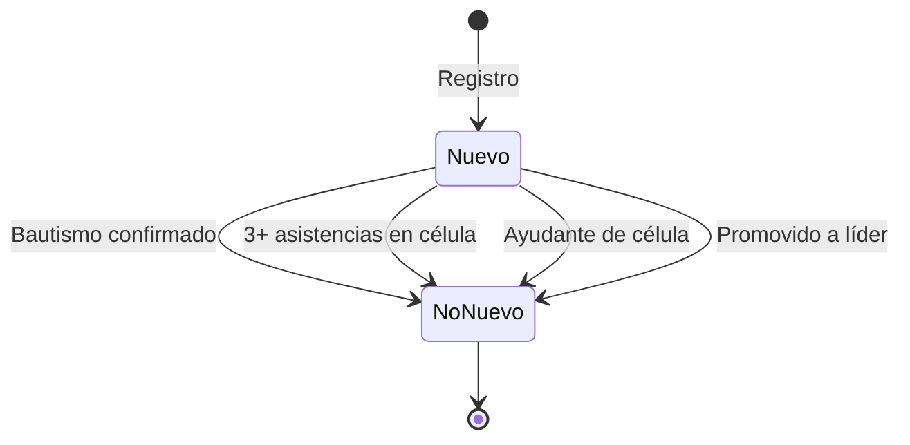

# Estados e historial de creyentes y líderes

Este documento describe cómo la aplicación **Manantial de Bendiciones** guarda, actualiza y consulta el estado de los creyentes (`members`) y su relación con los líderes (`leaders`).

Está pensado para desarrolladores, administradores de datos y quienes necesiten entender el ciclo de vida de una persona en el sistema.

---

## Colecciones principales en Firestore

| Colección | Propósito |
|-----------|-----------|
| `members` | Creyentes / integrantes de la iglesia |
| `members/{id}/visits` | Historial de visitas a un creyente |
| `members/{id}/history` | Historial de cambios de estado (registro, asignaciones, bautismo) |
| `leaders` | Líderes de la iglesia (datos personales y de contacto) |
| `cells` | Células y sus integrantes (subcolección `disciples` para discípulos legacy) |
| `baptismCalendar` | Fechas de bautismo programadas y creyentes asignados |
| `users` | Usuarios de la app (roles, `leaderId`, `churchId`) |

Un **líder** puede existir como documento en `leaders` y, al mismo tiempo, tener (o no) un documento vinculado en `members` mediante `linkedLeaderId`.

---

## Documento del creyente (`members`)

Modelo principal: `lib/members/models/church_member.dart`.

### Identidad y registro

| Campo | Tipo | Descripción |
|-------|------|-------------|
| `firstName`, `lastName`, `phone`, … | varios | Datos personales |
| `registeredAt` | timestamp | Fecha de creación del documento |
| `registeredBy` | string | Correo del usuario que registró |
| `formDate` | timestamp | Fecha del formulario |
| `churchId` | string | Iglesia a la que pertenece |
| `entrySource` | string | Dónde entró a la iglesia (evangelismo, iglesia madre, célula, etc.) |

### Origen del registro (`registrationSource`)

Indica **desde qué pantalla** se creó el creyente. **No cambia** después del primer registro.

| Valor | Pantalla | Significado |
|-------|----------|-------------|
| `registerMember` | `RegisterMemberScreen` | Registro general de creyente (asignación a líder opcional) |
| `registerMemberCell` | `RegisterMemberScreen` con célula | Registro de creyente directo a una célula |
| `registerCellMember` | `RegisterCellMemberScreen` | Registro desde el detalle de célula |
| `registerBaptismBeliever` | `RegisterBaptismBelieverScreen` | Registro para bautismo |

Archivo: `lib/members/models/member_registration_source.dart`.

### Marcas de tiempo del recorrido

| Campo | Cuándo se guarda |
|-------|------------------|
| `newBelieverAt` | Cuando se registra como nuevo creyente (`isNewBeliever: true`). **No se borra** al pasar `isNewBeliever` a `false` |
| `pastoralAssignedAt` | Al registrar con líder asignado (`RegisterMemberScreen` o bautismo con líder) |
| `cellAssignedAt` | **Primera vez** que se asigna a una célula (`assignMemberToCell`) |
| `baptizedAt` | Al confirmar bautismo (calendario) o al marcar manualmente como bautizado |

### Asignación a líder y célula

| Campo | Descripción |
|-------|-------------|
| `assignedLeaderId` | ID del líder en `leaders` responsable del seguimiento |
| `assignedLeaderName` | Nombre del líder (desnormalizado) |
| `assignedLeaderCellCode` | Código de célula del líder |
| `assignedLeaderFromRegistration` | `true` si el líder se asignó en el registro; pasa a `false` al asignar a célula |
| `assignedCellId` | ID de la célula en `cells` |
| `assignedCellCode` | Código de la célula |
| `assignmentKind` | `pastoral` o `cell` (tipo de asignación actual) |
| `assignedDistanceKm` | Distancia al líder (asignación automática por ubicación) |

**Tipos de asignación** (`MemberAssignmentKind`):

- **`pastoral`**: creyente nuevo con líder para visitas/seguimiento.
- **`cell`**: discípulo integrado a una célula.

> Al asignar a célula, `assignmentKind` pasa a `cell` y `assignedLeaderFromRegistration` a `false`, pero **`assignedLeaderId` puede conservarse** y los campos de recorrido (`registrationSource`, `pastoralAssignedAt`) **no se borran**.

### Estados del creyente

#### `isNewBeliever` (nuevo creyente)

- `true` por defecto al registrar en la mayoría de flujos.
- Al marcarse como nuevo creyente se guarda también **`newBelieverAt`** (fecha del registro como nuevo creyente).
- `false` cuando ocurre cualquiera de estos eventos ( **`newBelieverAt` se conserva** ):
  - Confirmación de bautismo en calendario (`updateMembersBaptismConfirmation`)
  - Promoción a líder / voluntario (`markMemberLeadershipStatus`)
  - Asignación como ayudante de célula (`clearNewBelieverForCellHelpers`)
  - Más de **3 asistencias presentes** en la célula (`graduateNewBelieversFromCellAttendance`)
  - Edición manual (se conserva el valor previo al editar)

Constante: `MemberService.cellPresentAttendancesToGraduateNewBeliever = 3`.

> Para reportes históricos (p. ej. dashboard pastoral) usa `newBelieverAt` / `effectiveNewBelieverAt`, no solo el booleano actual.

#### `isBaptized` y `baptizedAt`

| Origen | Comportamiento |
|--------|----------------|
| Calendario de bautismo (admin, fecha pasada) | `isBaptized: true`, `baptizedAt` = fecha del bautismo, `isNewBeliever: false` |
| Edición manual (`RegisterMemberScreen`) | Admin puede marcar/desmarcar bautizado |
| Registro nuevo | Siempre inicia `isBaptized: false` |

> El calendario guarda asignaciones en `baptismCalendar`; la confirmación final actualiza el documento en `members`.

#### `spiritualState` (estado espiritual)

Valores: `nuevoCreyente`, `enDiscipulado`, `miembroActivo`, `alejado`, `visitanteFrecuente`.

- Se puede registrar en cada **visita** (`MemberVisit`).
- Si la visita incluye estado espiritual, se **copia al documento** del creyente (`member_visit_service.dart`).

Archivo: `lib/members/models/spiritual_state.dart`.

#### `leadershipStatus` (estado de liderazgo en `members`)

Indica que el integrante pasó (o nació) como líder. Valores:

| Valor | Significado |
|-------|-------------|
| `createdAsLeader` | Se creó directamente como líder (`Nuevo líder`) |
| `promotedToLeader` | Era integrante y se promovió a líder (p. ej. división de célula) |
| `promotedToVolunteer` | Promovido a voluntario/registrador |

Campos relacionados:

- `linkedLeaderId`: ID del documento en `leaders`
- `promotedToLeaderAt`: fecha de promoción/creación como líder

Cuando hay `leadershipStatus`, el integrante **no puede** asignarse como discípulo de célula (`canBeAssignedAsCellDisciple`).

---

## Recorrido típico: registro → líder → célula → bautismo


### Detección en código

```dart
member.followedPastoralCellBaptismJourney // getter en ChurchMember
```

Condiciones:

1. `registrationSource == registerMember`
2. `pastoralAssignedAt != null`
3. `cellAssignedAt != null`
4. `isBaptized == true`

### Consulta en Firestore (ejemplo)

```
registrationSource == "registerMember"
pastoralAssignedAt != null
cellAssignedAt != null
isBaptized == true
```

---

## Historial de cambios (`members/{id}/history`)

Subcolección **append-only** (solo creación, sin edición ni borrado en reglas).

Modelo: `lib/members/models/member_history_event.dart`  
Servicio: `MemberService._appendMemberHistory`, `watchMemberHistory`.

| Evento (`type`) | Cuándo se registra |
|-----------------|-------------------|
| `registered` | Al crear el creyente (`addMember`) |
| `pastoralAssigned` | Si se guardó `pastoralAssignedAt` en el registro |
| `cellAssigned` | Cada vez que se asigna a una célula |
| `cellUnassigned` | Al quitar de una célula |
| `baptizedConfirmed` | Al confirmar bautismo en calendario |

Cada evento incluye:

- `occurredAt`: fecha/hora del evento
- `performedBy`: correo de quien ejecutó la acción (si está disponible)
- `details`: mapa con IDs relevantes (`leaderId`, `cellId`, `cellCode`, etc.)

**Visibilidad en la app:** sección «Historial de cambios» en el detalle del creyente (usuarios con permiso de gestión).

---

## Historial de visitas (`members/{id}/visits`)

Modelo: `lib/members/models/member_visit.dart`  
Servicio: `lib/members/services/member_visit_service.dart`.

Cada visita guarda:

- Fecha, lugar, comentario, oración, seguimiento pendiente
- `leaderId`: líder que realizó la visita
- `spiritualState` opcional (actualiza el campo homónimo en `members`)

Las visitas **no** generan eventos en `history`; son un historial paralelo orientado al seguimiento pastoral.

---

## Líderes (`leaders`)

Modelo: `lib/leaders/models/church_leader.dart`.

### Campos relevantes de estado

| Campo | Descripción |
|-------|-------------|
| `isBlocked` | Líder bloqueado (no aparece en listas de asignación) |
| `churchId` | Iglesia |
| `cellCode` | Código de célula del líder |
| `authUserId` | Vínculo con Firebase Auth / `users` |
| `appRoles` | Roles de app (líder, supervisor, registrador) |
| `churchOffice` | Cargo en la iglesia (p. ej. voluntario) |

### Relación con `members`

Al registrar un **nuevo líder** (`LeaderService.addLeaderWithMember`):

1. Se crea el documento en `leaders`.
2. Se llama a `syncMemberForPromotedLeader`:
   - Si ya existía como integrante (`existingMemberId`): se actualiza `leadershipStatus`.
   - Si no: se crea un `members` espejo con `createMemberForLeader`.

### Promoción desde célula

Al dividir célula o promover un ayudante, `markMemberLeadershipStatus` actualiza:

```
leadershipStatus: promotedToLeader | promotedToVolunteer
linkedLeaderId: <id del líder>
promotedToLeaderAt: <timestamp>
isNewBeliever: false
```

### Usuarios de la app (`users`)

Los roles (`admin`, `leader`, `supervisor`, `registrador`, `superadmin`) controlan permisos en la app (`AppPermissions`).  
El campo `leaderId` en el perfil del usuario vincula la sesión con un documento de `leaders`.

---

## Flujos por pantalla

### `RegisterMemberScreen`

| Escenario | `registrationSource` | `assignmentKind` | Otros |
|-----------|---------------------|------------------|-------|
| Creyente nuevo con líder | `registerMember` | `pastoral` | `isNewBeliever: true`, `pastoralAssignedAt` |
| Creyente directo a célula | `registerMemberCell` | `cell` (tras `assignMemberToCell`) | `cellAssignedAt` al asignar |
| Edición | Se conservan campos de recorrido | Puede cambiar según formulario | Bautizado editable manualmente |

### `RegisterCellMemberScreen`

- `registrationSource: registerCellMember`
- `assignmentKind: cell`
- Asignación inmediata a célula → `cellAssignedAt`

### `RegisterBaptismBelieverScreen`

- `registrationSource: registerBaptismBeliever`
- `isNewBeliever: true`, `isBaptized: false`
- Puede asignar líder → `pastoralAssignedAt`
- Tras guardar, puede asignarse al calendario de bautismo del día

### Asignar integrante existente a célula

`AssignCellMembersScreen` → `assignMemberToCell`:

- Actualiza `assignedCellId`, `assignmentKind: cell`
- Setea `cellAssignedAt` solo la **primera vez**
- Añade evento `cellAssigned` en `history`

### Calendario de bautismo

- **Fechas futuras/hoy:** asignar creyentes, editar hora/lugar (admin).
- **Fechas pasadas:** solo lectura + confirmación de bautizados (admin).
- Confirmación → `updateMembersBaptismConfirmation` → `isBaptized`, `baptizedAt`, evento `baptizedConfirmed`.

---

## Diagrama de estados simplificado (`isNewBeliever`)



---

## Datos anteriores a este sistema de recorrido

Los creyentes registrados **antes** de implementar `registrationSource`, `pastoralAssignedAt`, `cellAssignedAt` e `history`:

- Pueden tener `assignedLeaderId` y `assignedCellId` sin marcas de tiempo.
- No tendrán subcolección `history` hasta que pasen por un flujo nuevo.
- Se puede inferir parcialmente el estado actual, pero no el recorrido histórico exacto.

---

## Archivos de referencia en el código

| Tema | Archivo |
|------|---------|
| Modelo creyente | `lib/members/models/church_member.dart` |
| Origen de registro | `lib/members/models/member_registration_source.dart` |
| Tipo de asignación | `lib/members/models/member_assignment_kind.dart` |
| Estado espiritual | `lib/members/models/spiritual_state.dart` |
| Estado de liderazgo | `lib/members/models/member_leadership_status.dart` |
| Historial de eventos | `lib/members/models/member_history_event.dart` |
| Visitas | `lib/members/models/member_visit.dart` |
| Operaciones | `lib/members/services/member_service.dart` |
| Visitas (servicio) | `lib/members/services/member_visit_service.dart` |
| Modelo líder | `lib/leaders/models/church_leader.dart` |
| Líderes (servicio) | `lib/leaders/services/leader_service.dart` |
| Reglas Firestore | `firestore.rules` (`members`, `members/{id}/history`, `members/{id}/visits`) |
| UI detalle creyente | `lib/members/screens/member_detail_screen.dart` |

---

## Despliegue de reglas

Si se añade o modifica la subcolección `history`, desplegar reglas:

```bash
firebase deploy --only firestore:rules
```

---

## Resumen rápido

| Pregunta | Dónde mirar |
|----------|-------------|
| ¿Cómo se registró? | `registrationSource` |
| ¿Cuándo tuvo líder? | `pastoralAssignedAt` |
| ¿Cuándo entró a célula? | `cellAssignedAt` |
| ¿Está bautizado? | `isBaptized`, `baptizedAt` |
| ¿Sigue siendo nuevo creyente? | `isNewBeliever` |
| ¿Es líder también como integrante? | `leadershipStatus`, `linkedLeaderId` |
| ¿Historial de cambios? | `members/{id}/history` |
| ¿Historial de visitas? | `members/{id}/visits` |
| ¿Recorrido completo registro→líder→célula→bautismo? | `followedPastoralCellBaptismJourney` |
